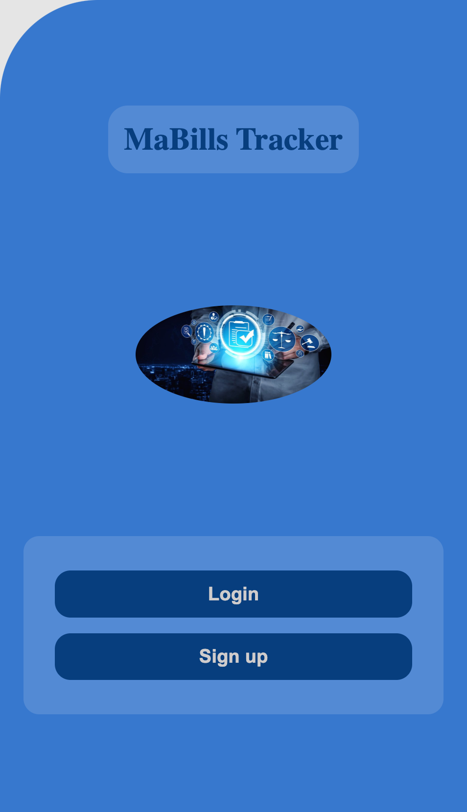
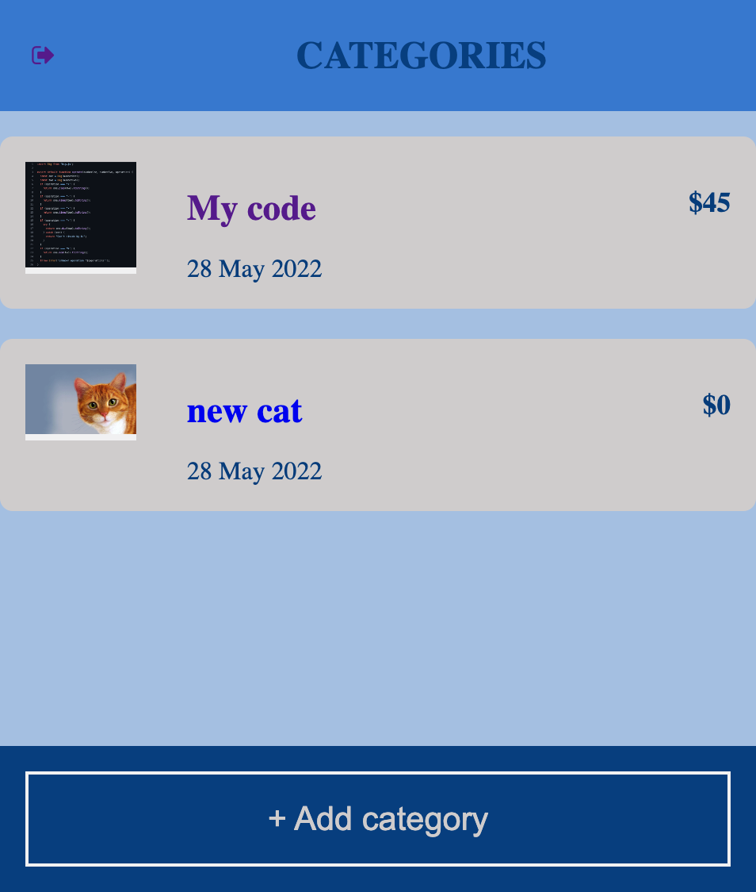
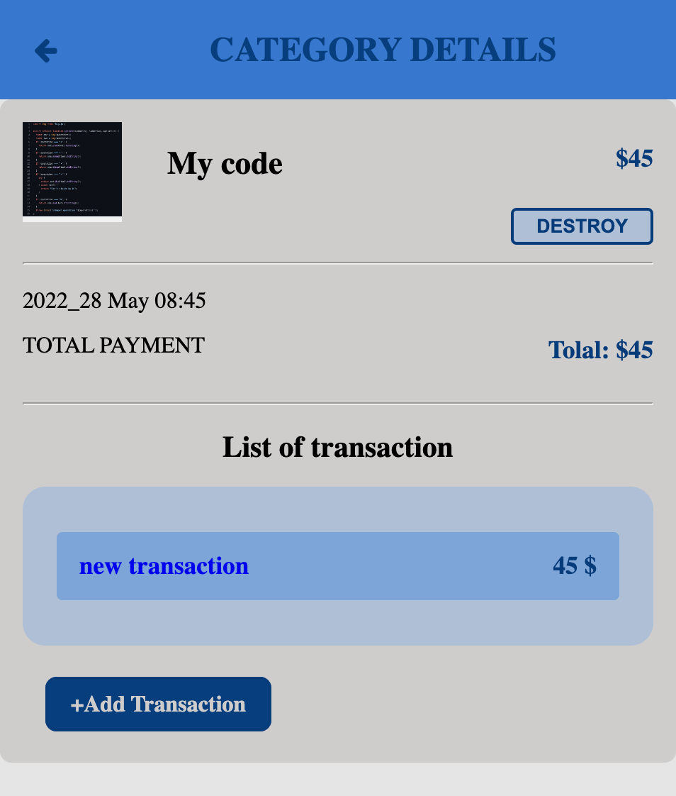
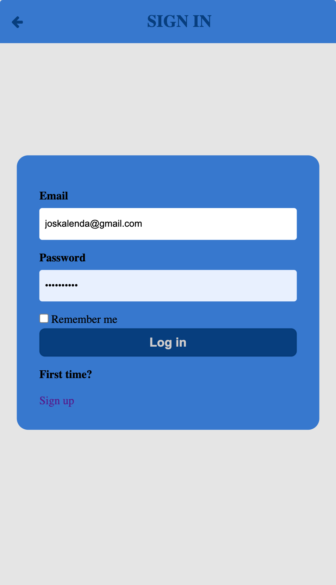
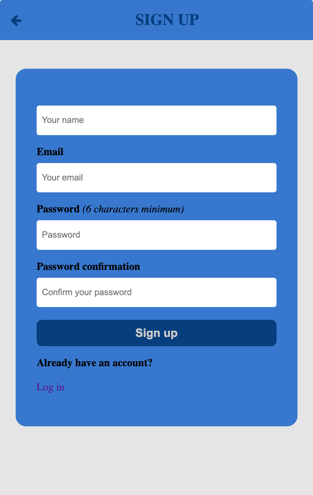
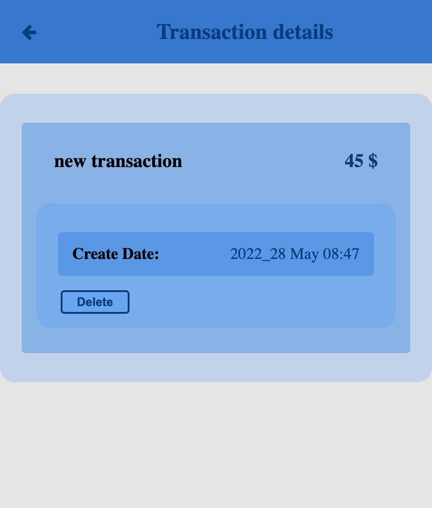

# Mabills-Tracker


## Description

> Mabills tracker enables you to monitor how much of your budget has been spent over time, to see how much is remaining and course-correct when necessary.

- User starting point:

  - register and log in.
  - introduce new transactions associated with a category.
  - see the money spent on each category regarding transaction.

### Viewshots 📸


|       Home Page                 |          Category Page                |        Category details    |
:--------------------------------:|:-------------------------------------:|:--------------------------:|
 | | |


|         Sign in form            |        Sign up form                   |    Transaction Details    |
:--------------------------------:|:-------------------------------------:|:-------------------------:|
 | | |


## Live Demo 🔗

[Live Demo](https://mabills-tracker.herokuapp.com/)

## Presentation video

[Demo presentation](https://www.loom.com/share/ef99d838b5054df2a11baf80e4cb784f)

## Getting Started

To get a local copy for this project and running follow these simple example steps.

### Prerequisites

- You need to have git installed in your machine.
- Install a recent version of Postgres.
- Install the latest version of Ruby
- Already install Rails


## Setup

## Setting Up PostgreSQL

- The postgres installation doesn't setup a user for you, so you'll need to follow these steps to create a user with permission to create databases

```bash
$  sudo -u postgres createuser budget-app -s
```

### Creating the Mabills-tracker application

- To create project with PostgreSQL database 

```bash
$   rails new Mabills-tracker --database=postgresql  #or
$   rails new Mabills-tracker -d postgresql

$   cd Mabills-tracker # Move into the application directory
```


### Clone this repository

```bash
$ git clone https://github.com/joskalenda/budget-app.git
$ cd budget-app
```

### Create the database

```bash
$   rails db:create   # or
$   rake db:create
```

### Install linter and 

- Rubocop gem

```bash
$  bundle init
$  bundle install
```
- Stylelint package

```bash
$  npm init -y
$  npm install
$  npm install --save-dev stylelint@13.x stylelint-scss@3.x stylelint-config-standard@21.x stylelint-csstree-validator@1.x

```

- Run linter and autocorrect linters

```bash
$  rubocop -A # or
$  rubocop --auto-correct-all
$  npx stylelint "**/*.{css,scss}" --fix 
```


### Starting up the Web Server

```bash
$   rails s # or
$   rails server # or

```

- To restart the server

```bash
$  sudo service postgresql restart 
$  rails db:reset #to clean the database                                                                    
```

#### Listing Existing Routes

- You can now visit `http://localhost:3000/routes` to view your new website!

 You can also execute the `rails routes` command in your terminal to produce the same output.


#### Generate rspec

- At the first you need to include those lines in your Gemfile

```bash
  gem 'rails-controller-testing'
  gem 'rspec-rails'
```

#### Install RSpec

```bash
$  rails generate rspec:install
```

- Then run:

```bash
$  rspec spec     # to test if your tests are passed
```

#### Generate MVC 

```bash
  $  rails g scaffold category name user:belongs_to
  $  rails g scaffold records name amount:decimal user:belongs_to 
  $  rails g scaffold category_records user:belongs_to
  $  rails g scaffold category_records category:belongs_to record:belongs_to
```

#### Generate Schema

- To push the Migration into the database

```bash
  $   rails db:migrate
```
- We use the seeds.rb file to records in the database
- To drop, create a table and to migrate and send the seed into the database:

```bash
  $   rails db:drop db:create db:migrate db:seed  
```

#### Run Capybara

```bash
$  bundle exec rspec ./spec/features/
```

#### Run spec

```bash
$  bundle exec rspec ./spec/models/
```

## Built With 🛠️

This project is build with:

-  
-  

## Authors

👤 **Jos Kalenda**

- GitHub: [@Joskalenda](https://github.com/joskalenda)
- Twitter [@JosKalenda](https://twitter.com/JosKalenda)
- LinkedIn [@JosKalenda](https://www.linkedin.com/in/jos-kalenda)

## 🤝 Contributor


Contributions, issues, and feature requests are welcome!

Feel free to check the [issues page](https://github.com/joskalenda/budget-app/issues).

## Show your support

Give a ⭐️ if you like this project!

## Acknowledgments

- Credit to [Gregoire Vella on Behance](https://www.behance.net/gregoirevella), the author of the original [design guidelines](https://www.behance.net/gallery/19759151/Snapscan-iOs-design-and-branding?tracking_source=)


## 📝 License

This project is [MIT](./MIT.md) licensed.
